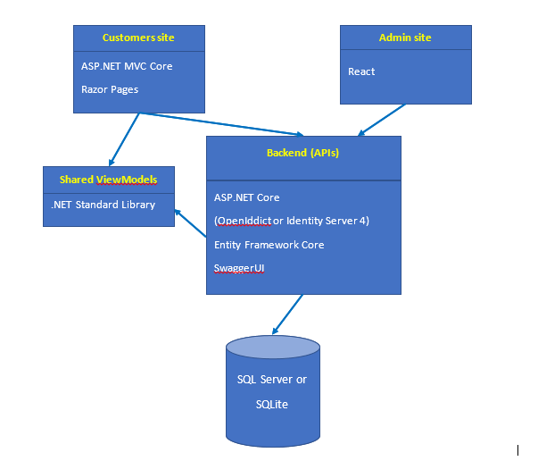

# RookieEShop
RookieEShop is a e-commerce website, where user can view and afford book.

## Azure Demo Link
- [CustomerSite](http://customersite-ndhoang123.azurewebsites.net/) || [Backend](https://backend-ndhoang123.azurewebsites.net/) || [AdminSite](https://sandhoang123.z23.web.core.windows.net) 
- For Adminsite, use email: abc@gmail.com, password: @Binheo123 to sign in the admin site

## LogicArchitecture



## Tech stack
The main programming language is Csharp, with .Net (5.0) framework, SQL Server, Entity framework and Identity Server.

## Features
#### Anonymous user
- View all products
- View products by category
- View product detail
- Register account
#### Signed-in user
- Rate product
#### Admin (Must authentication)
- Modify, create products
- Modify, create categories
- View users
## Get the code
Clone the repository:
```
git clone https://github.com/ndhoang123/RookieEShop.git
```
